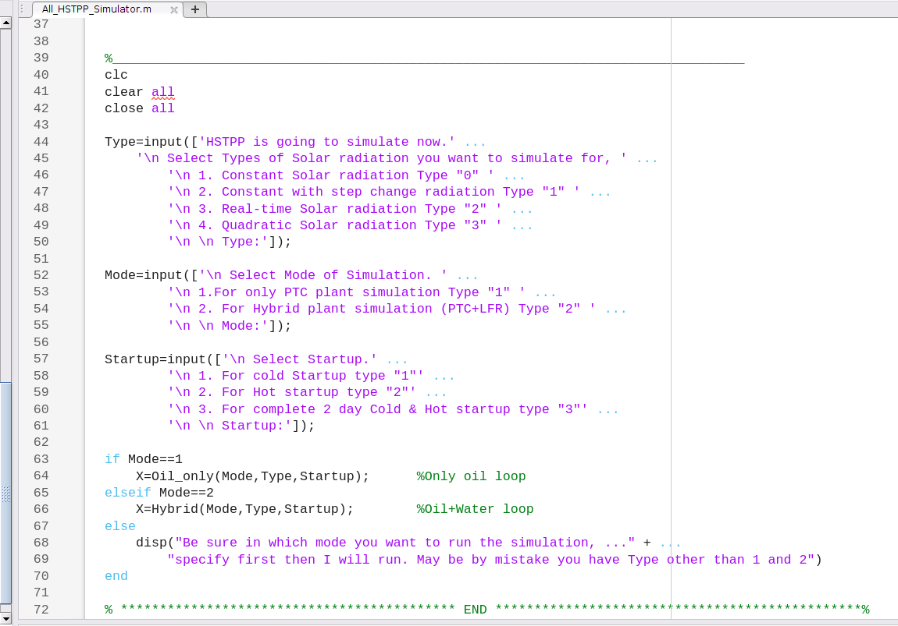
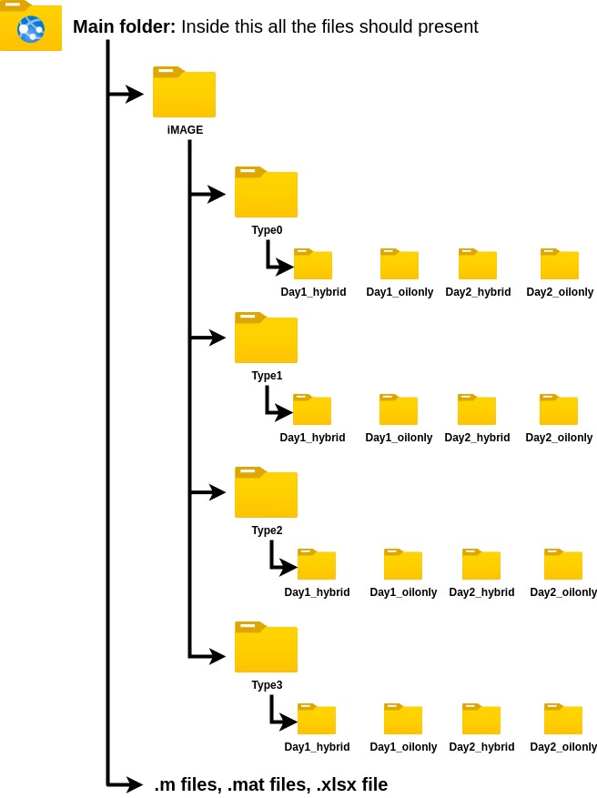
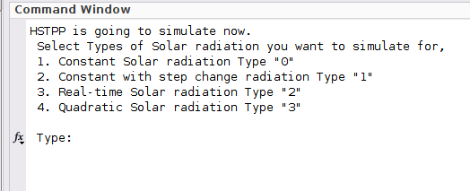
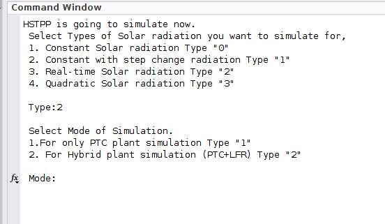
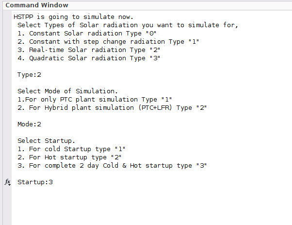
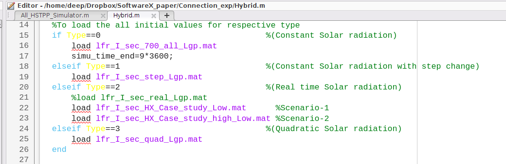

<h1>README file for HysolSim: Plantwide Dynamic Simulator for a Hybrid Solar Thermal Power Plant</h1>

**HysolSim**: `HysolSim` is a `MATLAB`-based codebase that serves as a dynamic simulator for a Hybrid Solar Thermal Power Plant (HSTPP), where both Parabolic Trough Collectors (PTC) and Linear Fresnel Reflectors (LFR) work as the concentrating mirrors. Note that the simulator can also be run in PTC-only mode, without the LFR. Further details are provided in the following sections. An article using the simulator, authored by Baidya et al. (2025), has been submitted to SoftwareX.

Details on how to test the simulator are provided in Section 3 of this README file.

# 1 Initialization

Before starting the HSTPP simulator, ensure that various parameter values and initial conditions for the plant are initialized as desired. All the initial conditions and parameter values are specified in the file `HSTPP_Parameters.m`. Values can be changed in this file by the user.[^1] After specifying values in the `HSTPP_Parameters.m` file, execute this file. It will then ask the user to choose the solar-radiation `Type` (`Type0`/`Type1`/`Type2`/`Type3`). The details about the various `Types` of solar radiation are discussed in the next section. After choosing the `Type`, a message asking the user to wait for some time will be displayed. During this time, the values of the newly changed parameters will overwrite the earlier ones in the respective `.mat` file. All the workspace variables are automatically saved in the `.mat` file, which will be loaded in the `Hybrid.m` or `Oil_only.m` script for running the simulator.

**Note:** Users can readily utilize the provided `.mat` files within the simulator without the necessity to access the `HSTPP_Parameters.m` file. This convenience allows users to seamlessly engage with the simulator, bypassing the need to adjust parameter values or initial conditions unless desired. The `HSTPP_Parameters.m` file becomes relevant only when users intend to modify such parameters or initial conditions to tailor the simulation to their specific requirements.

# 2 Simulator structure

The simulator has several pre-configured options. These are mentioned below.

## 2.1 Different `Types` for the simulator: depends on the solar-radiation profile

The simulator comes with various `Types` depending upon the solar-radiation profile. `Type0` is for constant solar radiation, `Type1` is for constant solar radiation with a step change, `Type2` is for real-time solar-radiation data extracted from the plant, and `Type3` is for quadratic solar radiation with cloud-cover disturbance. The proposed simulator comes with four pre-generated `.mat` files corresponding to four different types of solar-insolation profiles as follows:

- `Type 0`: This is for constant solar radiation, for ease of understanding the dynamic behavior of the plant, which loads from the `lfr_I_sec_700_all_Lgp.mat` file. The purpose of running the simulator with this profile is to enable the user to check whether the code is working, as there is no variation in the solar radiation.

- `Type 1`: This `Type` is for running the simulator with constant solar radiation having a step change from $700\ \mathrm{W/m^2}$ to $400\ \mathrm{W/m^2}$, which loads from the `lfr_I_sec_step_all_Lgp.mat` file. This change happens in one second. This profile is also for simulator testing purposes. Note that the user should not specify solar radiation below $400\ \mathrm{W/m^2}$, as it may lead to errors. The error may be in terms of complex numbers, or some variable may appear as not a number (NaN). Such errors can usually be identified and corrected through careful debugging.

- `Type 2`: This is for real solar-radiation data. This option can be used to get an idea of how solar plants behave under real conditions, and it loads from the `lfr_I_sec_real_all_Lgp.mat` file. This real-time data has been taken from the Gurgaon HSTPP plant for a summer day in 2014 [[1]](#ref1), [[2]](#ref2). This solar-insolation data is saved as the `maymonth.xlsx` file.

  **Note:** For Ubuntu, `.xlsx` will work, but for Windows OS, `maymonth.xlsx` should be changed to `maymonth.csv` format.

- `Type 3`: This is for the quadratic-type solar radiation with cloud cover present for some time, which loads from the `lfr_I_sec_quad_all_Lgp.mat` file. Cloud cover acts as a disturbance.

**Note:** The solar-radiation data used in the simulation are stored in the variable `lfr_I_sec` within the `Hybrid.m` and `Oil_only.m` files. Users may specify alternative solar-radiation profiles by modifying the corresponding data and sampling interval before the `if Startup==1` statement. Alternatively, solar-radiation and ambient-temperature data can be changed through the "To extract the solar radiation and ambient temp" section of the `HSTPP_Parameters.m` file, where the data are read from the Excel input file. After modifying the input data, users should rerun the simulator. The updated inputs will automatically be processed by the code and the corresponding results will be saved in the respective `.mat` files generated during the simulation.

## 2.2 Different `Modes` of the simulator

- `Mode 1`: In this mode, only the PTC field is operational, i.e., steam is produced only from the Steam Generator (SG). The LFR field is non-operational.

- `Mode 2`: In this mode, both PTC and LFR fields are operational. Thus, steam is produced from the SG as well as the LFR.

## 2.3 Different `Startup` types of the simulator

The simulator can replicate a two-day simulation with identical daily solar-radiation profiles. The first day represents a cold startup, starting with all initial conditions set to normal atmospheric conditions. Conversely, the second day corresponds to a hot startup, where all startup conditions are derived from dynamic nighttime cooling data.

- `Only Cold startup`: In this scenario, the plant commences operation from its initial state, which is presumed to be under nominal atmospheric conditions. It is important to note that the plant has been inactive for several days prior to this point.

- `Only Hot startup`: For this case, the initial condition of the plant depends on the data obtained from the cooling process during the nighttime of the last active day of operation. This startup condition will only function after a cold startup has been executed at least once. During the cold startup process, a `.mat` file is generated, which is essential for subsequent hot startup operations. Users must run the cold startup initially to ensure that the required data file is available for hot startup.

- `Cold+Hot startup`: In this scenario, the plant undergoes both cold startup and hot startup scenarios, requiring a comprehensive two-day simulation inclusive of nighttime cooling.

The user can choose any combination depending on the `Mode`, `Type`, and `Startup` option for the simulator to run. To start the simulator, open `All_HSTPP_Simulator.m` in MATLAB. A snapshot of this file is shown below in [Figure 1](#fig1).

  

<b>Figure 1:</b> Main script of the simulator

# 3 Simulation Procedure: to test/run the simulator

All the `.m` files, `.mat` files, the `.xlsx` file, and the `iMAGE` folder should be placed inside a single main directory. Within the `iMAGE` folder, there must be four subfolders named `Type0`, `Type1`, `Type2`, and `Type3`. Each of these `Type` folders should, in turn, contain four additional subfolders: `Day1_hybrid`, `Day1_oilonly`, `Day2_hybrid`, and `Day2_oilonly`, which are designated for saving the generated images. If any of these folders are missing, the user should create them before proceeding with code testing. The folder structure is illustrated in [Figure 2](#fig2).

  

<b>Figure 2:</b> Folder structure

The steps involved in running the simulator are briefly discussed below:

- Execute the file `All_HSTPP_Simulator.m` in MATLAB. A message will be displayed as shown in [Figure 3](#fig3) to select the `Type` of simulation.

  

    
  

  
<b>Figure 3:</b> Selecting Types

- The user can type any number from `0` to `3` and press enter. Another message will be displayed on the screen asking the user to select the `Mode` of operation, as shown in [Figure 4](#fig4).

  

    
  

  
<b>Figure 4:</b> Selecting Mode

- The user can choose either `1` or `2` and press enter. Another message will appear on the screen to select the `Startup` condition, as shown in [Figure 5](#fig5).

  

    
  

  
<b>Figure 5:</b> Selecting Startup condition

- The user can choose either `1`, `2`, or `3` and press enter.

  **Note:** Due to the large size of the generated `.mat` files, these files are not included in the uploaded package. Therefore, users are requested to initially perform a cold startup simulation by setting `Startup = 1` or `Startup = 3`. Once the required `.mat` files are generated, users can subsequently run simulations using any startup condition (`Startup = 1`, `Startup = 2`, or `Startup = 3`).

- Now the simulation will start. Wait for the simulation to end. As an example, if the hybrid plant (`Mode = 2`) is simulated with startup option `3`, then a total of 26 different figures for Day 1 (cold startup, with figure numbers 1 to 26) and another 26 figures for Day 2 (hot startup, with figure numbers 31 to 56) will be generated. Thus, the user should wait until the last figure is displayed to know that the simulation is complete. For oil-only mode (`Mode = 1`), Figures 1--11 will be generated for cold startup, while Figures 31--41 will be generated for warm startup.

- If the performance of the plant needs to be evaluated, then the user should execute the file `Performance_calculation.m`.

**Note:** The simulator has been successfully tested on Ubuntu 22.04.3 LTS and Windows 11/10 operating systems. MATLAB version R2024b has been used for simulation.

## 3.1 Troubleshooting Notes

Common troubleshooting points are as follows: (i) ensure that all `.m`, `.mat`, and input-data files are placed in the main simulator directory; (ii) ensure that the required `iMAGE` folder and its subfolders exist before running the code; (iii) run a cold-startup case first using `Startup = 1` or `Startup = 3` before running a hot-startup-only case, because the required startup `.mat` files are generated during cold startup; (iv) use the appropriate input-data format for the operating system, e.g., `.xlsx` or `.csv`, as described above; and (v) avoid non-physical input values, such as oil mass flow rate outside the intended range, because they may lead to NaN or complex-number values during property or heat-transfer calculations.

# 4 Simulation Time

In this section, we present some illustrative numbers to give an idea of the time taken for simulation. We consider a two-day simulation (startup option `3`) for various solar-insolation profiles and both modes of simulation (PTC alone and hybrid). All the simulations have been performed on a PC with the following specifications:

- Intel Core i9-13900K processor
- Asus Strix Z790-F
- 64 GB DDR5 RAM, 5200 MHz
- Samsung 980 M.2 SSD
- Ubuntu 22.04.3 LTS Operating System

[Table 1](#tab1) lists the time needed, in seconds, for simulation for various cases. This simulation time is recorded in the variable `Simu_time` in seconds.

**Note:** A system with 16 GB RAM or higher is preferable for running the simulator. Larger memory is beneficial for full hybrid and two-day simulations because the LFR discretization leads to a large ODE system. The case `Type = 0`, `Mode = 1`, and `Startup = 1` may be used as a lightweight demo/test case to verify that the simulator runs and generates the expected output figures.

<b>Table 1: Simulation time</b>

| Solar radiation Type | Day | Oil-only loop | Hybrid loop |
|---|---|---:|---:|
| Type-0 (Constant) | Day-1 | 7166 sec | 6847 sec |
|  | Day-2 | 7307 sec | 7292 sec |
| Type-1 (Step change) | Day-1 | 7236 sec | 7280 sec |
|  | Day-2 | 7348 sec | 7384 sec |
| Type-2 (Real-time) | Day-1 | 7220 sec | 7268 sec |
|  | Day-2 | 7334 sec | 7371 sec |
| Type-3 (Quadratic) | Day-1 | 7203 sec | 7252 sec |
|  | Day-2 | 7322 sec | 7357 sec |

# 5 Results

All the simulation plots are automatically saved into the `iMAGE` folder present in the simulator. Within the `iMAGE` folder, there are four other folders corresponding to the four `Types` of solar-radiation profiles (`Constant-Type0`, `Step change-Type1`, `Real-time-Type2`, and `Quadratic-Type3`). Within each such subfolder, the cold startup (Day 1) and warm startup (Day 2) results for both the oil-only loop and hybrid loop are provided. Inside the respective folders, the user can find all the generated images.

# 6 Abbreviation

- PTC: Parabolic Trough Collector.
- HT: High-temperature tank.
- LT: Low-temperature tank.
- SH: Superheater.
- SG: Steam Generator.
- PH: Preheater.
- LFR: Linear Fresnel Reflector.
- SD: Steam Drum.

# 7 Description of different function files in the simulator

The simulator consists of several `.m` files, which are briefly described below:

1. **solarfield**: Contains the dynamic model of the PTC. Here, 3 PDEs of the PTC are converted to 45 ODEs.
2. **density_oil**: Computes the density of oil, used in the PTC field, given its temperature.
3. **Cp_sf/Cp_oil**: Computes the specific heat capacity (`Cp`) of oil given its temperature.
4. **Kin_vis**: Computes the kinematic viscosity of oil given its temperature.
5. **Ther_con**: Computes the thermal conductivity of oil given its temperature.
6. **h_oil**: Function file for calculating the enthalpy of oil given its temperature.
7. **dbyden_sf**: Computes the derivative of the density of oil with respect to oil temperature.
8. **dbyCp_sf**: Computes the derivative of the specific heat capacity (`Cp`) of oil with respect to oil temperature.
9. **PTC_HT_LT_connection**: Connection file for PTC-HT-LT.
10. **PTC_LT_connection**: Connection file for PTC-LT.
11. **HTtank**: Contains the dynamic model of the HT tank.
12. **LTtank**: Contains the dynamic model of the LT tank.
13. **Energy_Compute_PTC**: Computes the energy produced by the PTC.
14. **Energy_Compute_LFR**: Computes the energy produced by the LFR.
15. **LFR_sub_fun1**: Contains initialization parameters for the LFR field.
16. **LFRsimulation**: Contains the dynamic model of the LFR.
17. **Xsteam**: Computes steam and water properties.
18. **ffrough**: Computes the surface friction factor for the LFR pipe produced from water/steam.
19. **Ffcw**: Computes the friction factor used in `ffrough`.
20. **h2o_mug**: Computes the dynamic viscosity of saturated steam at a given pressure.
21. **h2o_muf**: Computes the dynamic viscosity of saturated water at a given pressure.
22. **compute_hp**: Computes the heat transfer coefficient (HTC) for single- and two-phase flow in the LFR.
23. **absorb_exp/absorb**: Function file for the energy balance of the LFR absorber pipe and LFR glass envelope.
24. **SD_dynamics_updated_ode**: Contains the dynamic model of the steam drum.
25. **HXSG_subcool**: Function file for the steam generator in subcooled condition (dynamic model).
26. **HXSG_sat**: Function file for the steam generator in saturated condition (dynamic model).
27. **HXSH_bef_PTC**: Superheater function file when only the LFR is generating steam (dynamic model).
28. **PTC_HT_SH_SG_PH_LT_connection**: Connection file for PTC, HT, SH, SG, PH, and LT.
29. **mixer_SH**: Function file for the mixing of steam produced from the LFR and SG (static model).
30. **HXSH**: Contains the dynamic model of the superheater.
31. **HXPH**: Contains the dynamic model of the preheater.
32. **All_HSTPP_Simulator**: Main file to run the simulator.
33. **Hybrid**: Main file for the whole hybrid (PTC+LFR) plant for Day 1 (cold startup).
34. **Oil_only**: Main file for the PTC-only loop for Day 1 (cold startup).
35. **day2**: Main file for the whole hybrid (PTC+LFR) plant for Day 2 (hot startup).
36. **day2_oil_only**: Main file for the PTC-only loop for Day 2 (hot startup).
37. **HSTPP_Parameters**: File assigning values to various parameters and initialization variables.
38. **h2o_mu**: Gives the dynamic viscosity at a given temperature and density of water.
39. **h2o_muf**: Gives the dynamic viscosity of saturated water at a given pressure.
40. **H2o_mug**: Gives the dynamic viscosity of saturated steam at a given pressure.
41. **h2o_rhof**: Gives the saturated density of water at a given pressure.
42. **h2o_rhog**: Gives the saturated steam density at a given pressure.
43. **h2o_rhos**: Gives the superheated density of steam at a given temperature and pressure.
44. **h2o_rhol**: Gives the subcooled density of water at a given temperature and pressure.
45. **h2o_tsat**: Gives the saturation temperature of water at a given pressure in °C.
46. **HXSG_night1**: Contains the dynamic model for SG nighttime cooling.
47. **Nighttime_cooling**: Contains the dynamic model of nighttime cooling for hybrid plants (PTC+LFR).
48. **Nighttime_cooling_Oil_only**: Contains the dynamic model of nighttime cooling for the PTC plant.
49. **Plot_coldSU**: Gives all the plots for the cold startup of HSTPP.
50. **Plot_hotSU**: Gives all the plots for the hot startup of HSTPP.
51. **Plot_oil_only**: Gives all the plots for the cold startup of the oil loop (PTC-only plant).
52. **Plot_hotSU_oil_only**: Gives all the plots for the hot startup of the oil loop (PTC-only plant).
53. **SD_night1**: Contains a dynamic model for SD nighttime cooling.
54. **SetGraphics**: Used for graphics formatting.
55. **UAF_PH_fun**: Used to calculate the heat transfer coefficient of PH when the PH water mass flow rate is greater than 0.01 kg/s.
56. **UAF_PH_mw0**: Used to calculate the heat transfer coefficient of PH when the PH water mass flow rate is less than 0.01 kg/s.
57. **UAF_SG_fun**: Used to calculate the heat transfer coefficient of SG in a saturated condition.
58. **UAF_SG_sub_fun**: Used to calculate the heat transfer coefficient of SG in subcooled conditions.
59. **UAF_SH_fun**: Used to calculate the heat transfer coefficient of SH.
60. **Performance_calculation**: With the help of this file, the user can evaluate different performance criteria of the plant.
61. **enthal_temp_HT/enthal_temp_LT**: Function file for calculating the enthalpy of HT/LT oil.
62. **event_fun_SD**: Provides `options` for steam drum dynamics.
63. **Extra_Enthalpy_Temp_Convert**: Finds the temperature of oil from oil enthalpy. It is an extra file for checking purposes.
64. **h2o_hf**: Finds the saturated enthalpy of water at a given pressure.
65. **h2o_hfg**: Finds the latent heat of evaporation of vapor at a given pressure.
66. **h2o_hg**: Finds the saturated enthalpy of vapor at a given pressure.
67. **h2o_hl**: Finds the subcooled enthalpy of water at a given temperature and pressure.
68. **h2o_hs**: Finds the superheated enthalpy of steam at a given temperature and pressure.
69. **h2o_mul**: Finds the dynamic viscosity of subcooled water.
70. **h2o_psat**: Finds the saturation pressure of water at a given temperature in kPa.
71. **h2o_rhotp**: Finds the two-phase density of water in kg/m^3.
72. **h2o_sigma**: Finds the surface tension of water at a given temperature.
73. **h2o_sl**: Finds the subcooled entropy of water at a given temperature.
74. **h2o_ss**: Finds the superheated steam entropy at a given temperature and pressure.
75. **HXSG_height**: Finds the steam generator water height.

# 8 Case Study

To illustrate how the simulator can be used to investigate different designs, we perform a case study from the paper "HysolSim: A Digital Twin Framework for HSTPP Simulation and Analysis" by Baidya et al. [[3]](#ref3) for two scenarios: (i) Scenario-1, where the HT and LT tanks contain 5000 kg of oil each; and (ii) Scenario-2, where the HT and LT tanks contain 15,000 kg and 5,000 kg of oil, respectively, i.e., more oil is available in Scenario-2. For Scenario-1, load the `lfr_I_sec_HX_Case_study_Low.mat` file, and for Scenario-2, load the `lfr_I_sec_HX_Case_study_high_Low.mat` file. The user should ensure that while considering Scenario-1, the line `load lfr_I_sec_HX_Case_study_high_Low.mat %Scenario-2` should be commented. Similarly, while considering Scenario-2, the line `load lfr_I_sec_HX_Case_study_Low.mat %Scenario-1` should be commented. In [Figure 6](#fig6), line no. 22 is for Scenario-1, and line no. 23 is for Scenario-2.

This specific case-study simulation will be performed with the options `Type = 2`, `Mode = 2`, and `Startup = 1`. The purpose of this case study, along with all the simulation results and discussions, is described in the paper published by Baidya et al. [[3]](#ref3).

  

<b>Figure 6:</b> Case Study

# 9 Applicability and Adaptation of HysolSim

HysolSim is currently developed for a HSTPP comprising PTC, LFR, thermal-storage, and power-generation subsystems. Although the modular structure facilitates adaptation to similar solar-thermal facilities, application to fundamentally different systems (e.g., HVAC, building-energy, or industrial-process systems) would require the development and validation of additional component models. Furthermore, guidance regarding the adaptation of HysolSim to other solar-thermal facilities and the use of experimental data for model validation has been clarified in the software documentation and supporting information.

[^1]: The simulator has not been tested extensively for various initial conditions or parameter values. Thus, provide reasonable values for these quantities. It has been only tested for the plant described in the paper.

## References

[1]. I. B. Project, National solar thermal power plant, https://www.ese.iitb.ac.in/~NSTPP/.

[2]. S. Kannaiyan, S. Bhartiya, M. Bhushan, Dynamic modeling and simulation of a hybrid solar thermal power plant, Industrial & Engineering Chemistry Research 58 (2019) 7531–7550. doi: 10.1021/acs.iecr.8b04730.

[3]. D. Baidya, S. Kannaiyan, M. Bhushan, S. Bhartiya, Simulator for hybrid solar thermal power plant, SoftwareX (2025).

